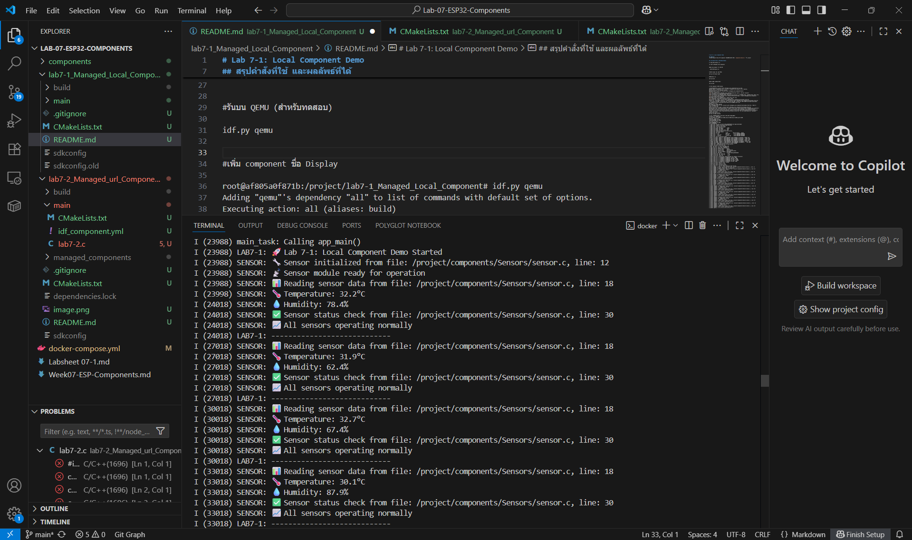
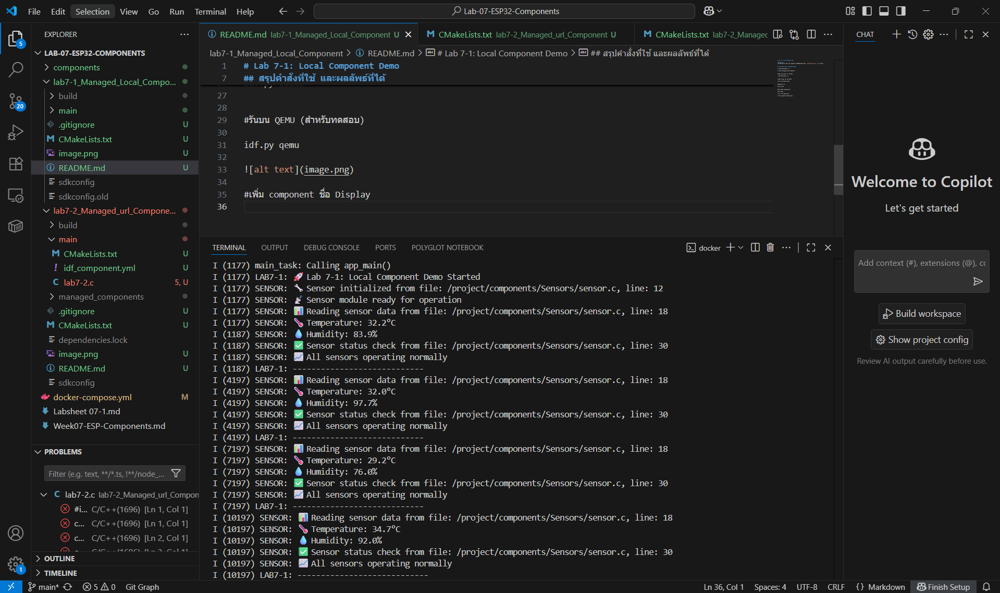

# Lab 7-1: Local Component Demo

## คำอธิบาย
การทดลองนี้แสดงการใช้งาน component ที่มีอยู่ในโฟลเดอร์ `components/Sensors/` ของ project

## สรุปคำสั่งที่ใช้ และผลลัพธ์ที่ได้

#เข้าไปในโฟลเดอร์โปรเจค

cd lab7-1_Managed_Local_Component

#โหลด environment ของ ESP-IDF

. $IDF_PATH/export.sh

#กำหนด target ให้เป็น ESP32

idf.py set-target esp32

#คอมไพล์โปรเจค

idf.py build

#รันบน QEMU (สำหรับทดสอบ)

idf.py qemu

#เพิ่ม component ชื่อ Display

